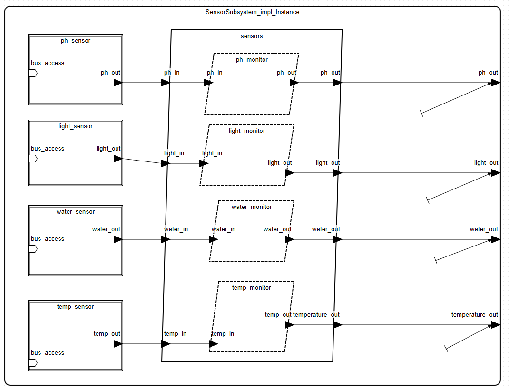
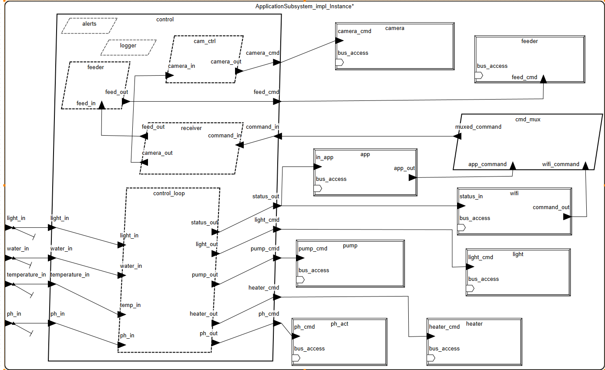
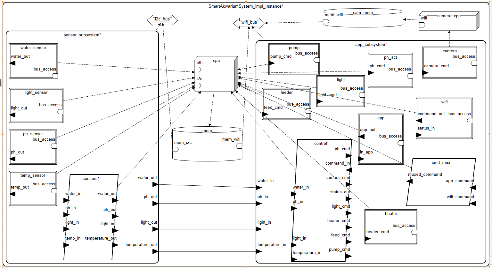
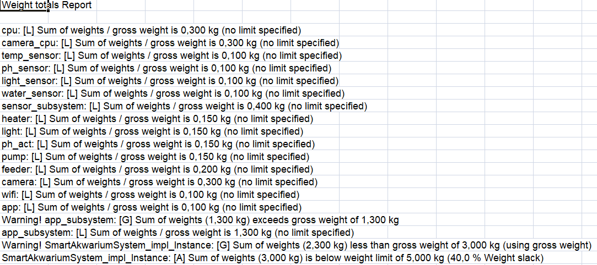
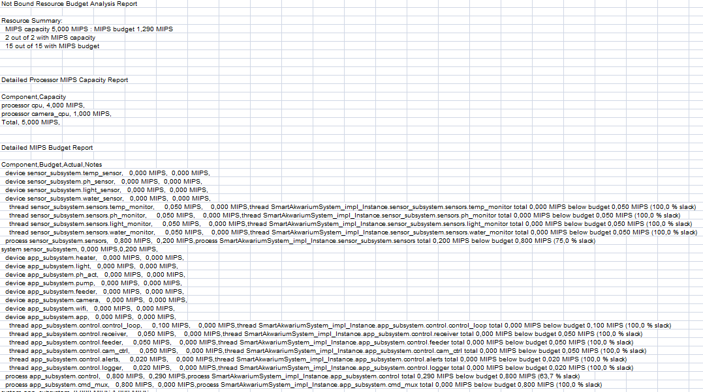

# Systemy czasu rzeczywistego - Model Smart Akwarium w języku AADL

## Autorzy:
- Gabriela Bułat, gbulat@student.agh.edu.pl
- Emilia Myrta, emiliamyrta@student.agh.edu.pl

## Opis projektu

**Smart Akwarium** to zintegrowany system monitorowania i sterowania parametrami wodnego akwarium, realizowany w języku AADL. System składa się z wielu komponentów podzielonych na różne typy AADL. Model systemu wykorzystuje właściwości SEI oraz analiz MIPS i przepustowości magistrali (Bus Load).

## Funkcjonalności systemu:

Monitorowanie oraz automatyczne sterowanie:

- temperaturą wody,

- poziomem pH,

- oświetleniem,

- poziomem wody.

Podgląd w czasie rzeczywistym z kamery.

Sterowaniem karmieniem ryb.

Przesyłania statusu oraz alertów przez WiFi.

Komunikacja z użytkownikiem poprzez aplikację (WiFi).

## Struktura systemu:
 
 ### Główne podsystemy:

 #### SensorSubsystem
- Odpowiada za zbieranie danych z czujników.
- Wykorzystuje proces SensorProcess.
- Udostępnia dane do dalszego przetwarzania.

#### ApplicationSubsystem
- Zawiera logikę sterującą oraz urządzenia i interfejsy z aplikacją użytkownika.
- Realizuje funkcje decyzyjne w oparciu o dane z SensorSubsystem.

## Główne komponenty modelu AADL:

 ### Data:
- `Timestamp` – znacznik czasu dla każdej próbki danych.
- `TemperatureData`, `PHData`, `LightLevelData`, `WaterLevelData` – dane pomiarowe.
- `PHDoseData`, `FeedingCommand`, `CameraCommand`, `CommandData` – dane sterujące.
- `NetworkPacket`, `SensorReading`, `SchedulerConfig` – dane komunikacyjne i pomocnicze.

### Threads
- Wątki monitorujące: `TempMonitor`, `PHMonitor`, `LightMonitor`, `WaterLevelMonitor`
- Wątki sterujące: `ControlLoop`, `FeedingControl`, `CameraControl`
- Komunikacja i diagnostyka: `NetworkReceiver`, `AllertManager`, `Logger`, `cmd_mux`
  
### Process
- `SensorProcess` – obsługa i przetwarzanie danych z czujników.
- `ControlProcess` – logika decyzyjna i sterowanie urządzeniami.

### Devices
- Czujniki: `TemperatureSensor`, `PHSensor`, `LightSensor`, `WaterLevelSensor`
- Urządzenia wykonawcze: `HeaterActuator`, `LightActuator`, `PHActuator`, `WaterPumpActuator`, `FishFeeder`
- Komunikacja: `WiFiModule`, `FishCamera`, `UserAppDevice`

### Bus
- `I2CBus` – magistrala sprzętowa czujników.
- `WiFiBus` – logiczna magistrala komunikacyjna z aplikacją.

### Processor
- `RPiController` – procesor główny systemu.
- `CameraProcessor` – dedykowany procesor dla kamery.

### Memory
- `MainMemory` – pamięć główna systemu.
- `CameraMemory` – pamięć dedykowana obsłudze kamery.

### System
- `SmartAkwariumSystem` – top-level system integrujący podsystemy: SensorSubsystem i ApplicationSubsystem, wraz z procesorami, pamięciami i magistralami.

# Architektura systemu.

### Diagram podsystemu sensorów

### Diagram podsystemu aplikacji

### Diagram systemu głównego

# Analizy

### Analiza Weight Totals

### Analiza MIPS Budget

# Bibliografia:

- [Empowering Aquarists a Comprehensive Study On IOT-Enabled Smart Aquarium Systems For Remote Monitoring And Control](https://www.researchgate.net/publication/382053839_Empowering_Aquarists_a_Comprehensive_Study_On_IOT-Enabled_Smart_Aquarium_Systems_For_Remote_Monitoring_And_Control)

- [Implementation of GSM Module based Smart Aquarium Monitoring and Controlling System](https://www.researchgate.net/publication/375553645_Implementation_of_GSM_Module_based_Smart_Aquarium_Monitoring_and_Controlling_System)

- [Assess your aquarium’s health with an AI-enabled ultrasonic sensor](https://blog.arduino.cc/2024/05/07/assess-your-aquariums-health-with-an-ai-enabled-ultrasonic-sensor/)

- [The Architecture Analysis and
Design Language: an overview](http://www.openaadl.org/downloads/tutorial_models15/part1_introducing_aadl.pdf)
