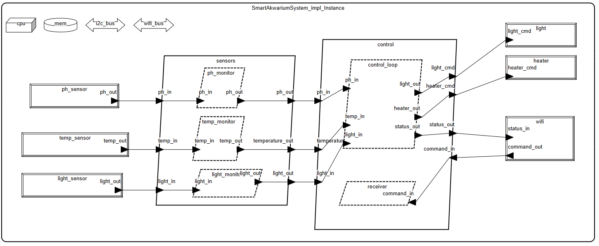

# Systemy czasu rzeczywistego - Model Smart Akwarium w języku AADL

# Autorzy:
- Gabriela Bułat, gbulat@student.agh.edu.pl
- Emilia Myrta, emiliamyrta@student.agh.edu.pl

# Opis projektu

Smart Akwarium to zintegrowany system sterowania akwarium, realizowany w języku AADL, którego celem jest monitorowanie i zarządzanie parametrami środowiska wodnego. System składa się z wielu komponentów podzielonych na różne typy AADL.

# Funkcjonalności systemu:

Monitorowanie oraz zmiana:

- temperatury,

- pH wody,

- naświetlenia,

- poziomu wody.

Możliwość przesyłania statusu oraz alertów przez WiFi.

Możliwość dokarmiania ryb.

Możliwość podglądu akwarium dzięki  real-time kamery.

# Planowane komponenty projektu:
 
 ### Pakiet
- SmartAkwarium – główny pakiet zawierający wszystkie komponenty systemu inteligentnego akwarium.

 ### Data 
- TemperatureData – dane z czujnika temperatury wody.

- PHData – dane z czujnika pH wody.

- LightLevelData – dane dotyczące poziomu oświetlenia akwarium.

- WaterLevelData - dane dotyczące poziomu wody w akwarium.

- CommandData – komendy przychodzące z zewnątrz (np. z aplikacji mobilnej).

- SchedulerConfig – konfiguracja harmonogramu sterowania.

- NetworkPacket – dane do przesyłania przez sieć (np. status, alerty).

- SensorReading – uogólniona struktura pojedynczego odczytu z czujnika.

### Threads
- TempMonitor – wątek monitorujący temperaturę wody.

- PHMonitor – wątek monitorujący pH wody.

- LightMonitor – wątek monitorujący poziom oświetlenia.

- WaterMonitor - wątek moniturujący poziom wody.

- NetworkReceiver – wątek odbierający komendy z sieci.

- ControlLoop – wątek przetwarzający dane i podejmujący decyzje sterujące.

- FeedingControl - sterowanie karmnikiem.

- CameraControl - sterowanie kamerą.

- WaterPumpControl - sterowanie poziomem wody.

- AllertManager - watek zarządzający alertami i powiadomieniami.

- Logger - wątek rejestrujący dane pomiarowe.

### Process
- SensorProcess – proces zawierający wątki czujników (zbierających dane).

- ControlProcess – proces zawierający logikę sterowania na podstawie danych z czujników.

### Devices
- TemperatureSensor – fizyczny czujnik temperatury.

- PHSensor – czujnik poziomu pH wody.

- LightSensor – czujnik natężenia światła.

- WaterLevelSensor - czujnik poziomu wody.

- HeaterActuator – urządzenie wykonawcze: grzałka.

- LightActuator – urządzenie wykonawcze: oświetlenie.

- WaterPumpActuator - urządzenie wykonawcze: pompa wodna.

- WiFiModule – moduł komunikacji bezprzewodowej Wi-Fi.
  
- FishFeeder - urządzenie wykonawcze: podajnik pokarmu.
  
- FishCamera - kamera do osobistej kontroli habitatu.

- UserAppDevice - urządzenie zewnętrzne np.aplikacja mobilna.

### Bus
- I2CBus – magistrala komunikacyjna dla czujników.

- WiFiBus – logiczna magistrala do przesyłania danych przez Wi-Fi do aplikacji.

### Processor
- RPiController – główny procesor sterujący.

### Memory
- MainMemory – pamięć operacyjna dla systemu.

### System
- SmartAkwariumSystem – top-level system integrujący wszystkie komponenty.

# Architektura systemu.

# Bibliografia:

- [Empowering Aquarists a Comprehensive Study On IOT-Enabled Smart Aquarium Systems For Remote Monitoring And Control](https://www.researchgate.net/publication/382053839_Empowering_Aquarists_a_Comprehensive_Study_On_IOT-Enabled_Smart_Aquarium_Systems_For_Remote_Monitoring_And_Control)

- [Implementation of GSM Module based Smart Aquarium Monitoring and Controlling System](https://www.researchgate.net/publication/375553645_Implementation_of_GSM_Module_based_Smart_Aquarium_Monitoring_and_Controlling_System)

- [Assess your aquarium’s health with an AI-enabled ultrasonic sensor](https://blog.arduino.cc/2024/05/07/assess-your-aquariums-health-with-an-ai-enabled-ultrasonic-sensor/)

- [The Architecture Analysis and
Design Language: an overview](http://www.openaadl.org/downloads/tutorial_models15/part1_introducing_aadl.pdf)
